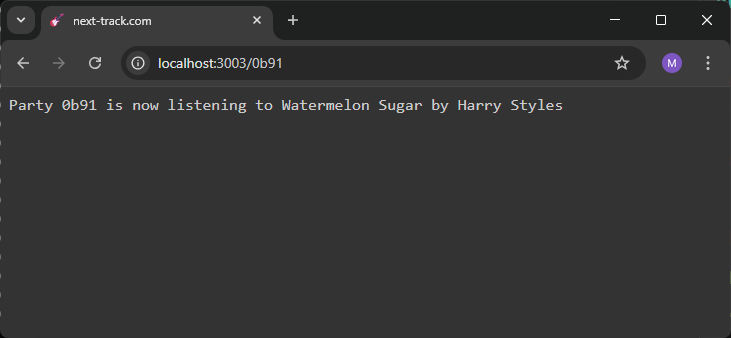

# next-track.com

Dette projekt udgør et *walking skeleton* af projektet next-track.com

Her følger en oversigt over projektets indhold:

## Roden af projektet

`README.md`\
Denne fil.

`screen-shot.png`\
Skærmbilledet nederst i denne fil.

`package.json`\
Projekt-metadata og afhængigheder.

`package-lock.json`\
Information om installerede versioner af afhængigheder.

`.gitignore`\
Information om, hvilke filer og foldere, git skal ignorere.

**TODO**: I skal selv tilføje en `.env` fil  med database-hemmeligheder i jeres lokale klon. Når I kører `npm install`, får I desuden en `node_modules/` folder.

## db/

`createDb.js`\
Script til at re-etablere databasen. Køres med
```sh
npm run create-db
```
Scriptet skaber én tabel, `tracks`, med tracks læst fra...

`short-tracks.csv`\
Et lille antal tracks med kort duration, så vi ikke keder os alt for meget, mens vi venter på, at et track spiller færdigt.

`connect.js`\
Delt kode til at forbinde til databasen. Den bruges både i `db/createDb.js` og i `backend/server.js`.

**TODO**: Jeres database skal være meget mere interessant, så som

- mange flere tracks
- mere information om dem, i normaliserede tabeller som fx `artists` og `albums`
- information om, hvilket track, der bliver afspillet lige nu til hvilke fester -- skelettet glemmer den information, når webserveren genstartes
- al mulig anden information, som jeres løsning bruger til at vælge det næste track,
herunder formentlig information om brugerne

## backend/

`server.js`\
Den kender I. Serveren definerer ét slutpunkt, `/api/party/:partyCode/currentTrack`, sådan at man kan få information om det track, der lige nu spilles til en given fest. Hver fest har en kode, som er en tekststreng med fire hex-cifre. Til festen `a3f7` spilles lige nu tracket `/api/party/a3f7/currentTrack`.

Serveren vedligeholder en ordbog, `currentTracks`, hvor nøgler er party-koder og værdier er tracks (mere præcist: indices i en vektor af tracks, som serveren har hentet i databasen).

Når frontenden beder serveren om at fortælle, hvad der bliver spillet til en bestemt fest, slår serveren op i `currentTracks`. Hvis den ikke finder noget, vælger den et track tilfældigt og opretter et nyt opslag i ordbogen. Så kalder den funktionen `play` i `player.js`. Den funktion simulerer afspilning.

Når serveren sætter et nyt track til at spille, giver den `play`-funktionen en callback-funktion med, som `play` sørger for bliver kaldt, når sangen er slut. Callback'en fjerner så det relevante opslag i `currentTracks`.

Hvis festen fortsætter, spørger frontenden igen, og serveren vælger et nyt, tilfældigt track. On and on it goes.

`player.js`\
Simulerer integration med nærmeste relevante højttaler. Koden definerer én funktion, `play`. I kan se i `server.js`, hvordan den bruges. Det er ikke meningen, at I skal ændre noget i `player.js`.

**TODO**: Yay, super. Men der skal jo nok være andre slutpunkter også, efterhånden som jeres frontend bliver mere interaktiv. Og I får jo nok også brug for at gemme flere ting i databasen, så vi fx ikke glemmer, hvad der bliver spillet til festerne, bare fordi vi genstarter webserveren. Og så I kan opsamle nyttig information om brugerne og de dele af deres interaktion med app'en, som er med til at bestemme *next track*.

## frontend/
`index.html`\
Den kender I. Der er et `div`-element til dynamisk indhold, som opdateres af koden i `index.js`.

`index.js`\
Frontend-logik. Vi venter på, at DOM'en loader og derefter læser vi party-koden fra URL'en -- eller finder på en kode, hvis der ikke er nogen. Så holder vi bare vores egen fest!

Logikken starter også et *polling loop*, hvor vi en gang i sekundet spørger webserveren om hvad festen lytter til -- og opdaterer HTML'en med svaret.

`styles.css`\
Meget kedelig styling. Næsten-hvidt på næsten-sort. Monospace. Suk. Man skulle tro, nogen havde været i praktik på codelabby.com.

`favicon.ico`\
Ikon til at vise i browser-tab'en.

**TODO**: Det var dog kedeligt. Gør noget! Brugeren skulle fx gerne kunne interagere med app'en og på en eller anden måde have indflydelse på, hvad der bliver spillet.

